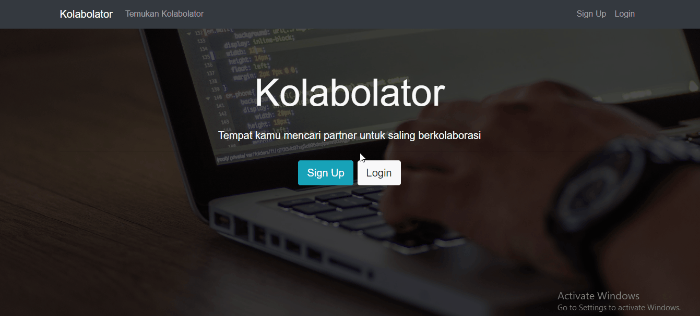
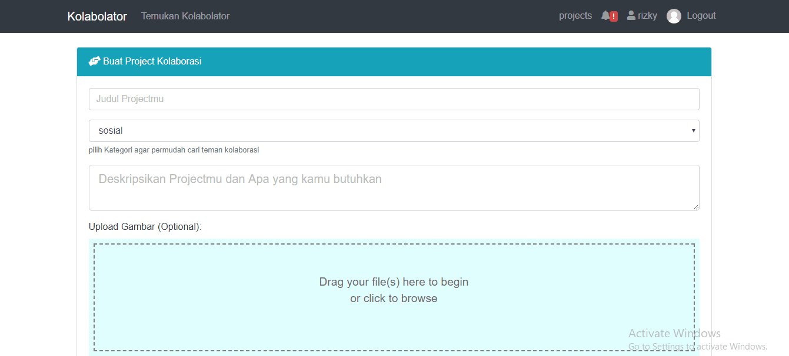

Platform untuk saling berkolaborasi, Single Page apps with MEAN Stack.

# kolabolator_v2
using laravel+vueJS to create SPA



**invite others** <br>


**tech** <br>
1.Frontend : ReactJS + Redux + Bootstrap<br>
2.Backend : NodeJS + ExpressJS + MongoDB

**How to use** <br>
1.migrasi database dengan ```php artisan migrate``` atau import db.sql<br>
2.```npm run dev``` to run server
